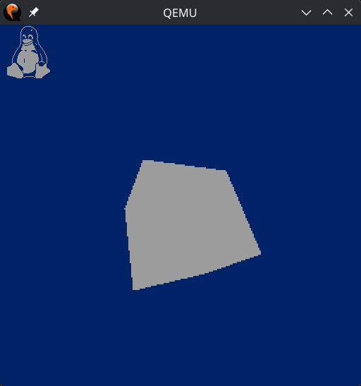

# fbdevcube
Like kmscube but betterer

## Compiling

Since there are no libraries etc you just need to set the right compiler for the target
and when the Linux source is so that the nolibc header can be found.

```CC=<probably a prefix>/m68k-buildroot-uclinux-uclibc-gcc KDIR=<your kernel source> make```

## Show me!

Running on an emulated 68000 system (DragonBall EZ, think old palm pilot) running
a mainline kernel with a few patches.


